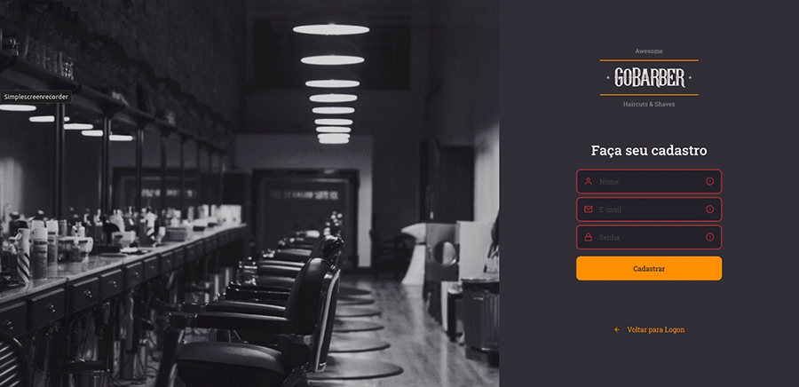

<p align="center">
  
</p>
<p align="center">Managing appointments in barbershops builting React.js, Typescript and Styled Components.</p>

## Features

<p align="center">
  
</p>

<p align="center">
  
</p>

<p align="center">
  
</p>

## Installation

You may clone this repository.

```
  git clone git@github.com:marcuspereiradev/gobarber-web.git
```
<p align="center">
  
</p>

Inside the created directory run the scripts in order to execute the application.

```
  // Install the dependencies
  yarn install
```

<p align="center">
  
</p>

```
  // Start the application
  yarn start
```

<p align="center">
  
</p>

## License
This project is under MIT license. See the archive [LICENSE](./LICENSE) to more details.

## Authors

|  [Marcus Pereira](https://github.com/marcuspereiradev)   |
